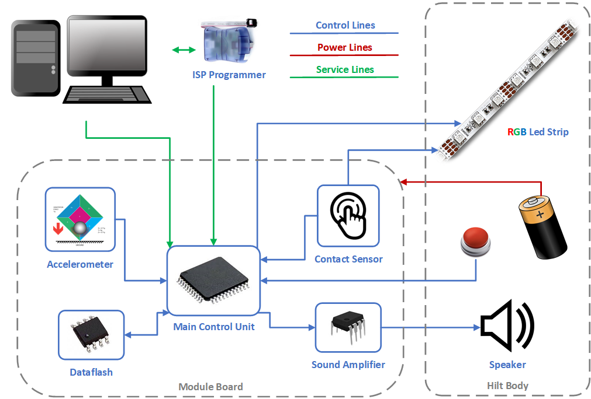
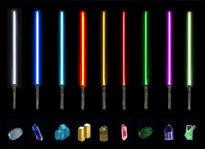
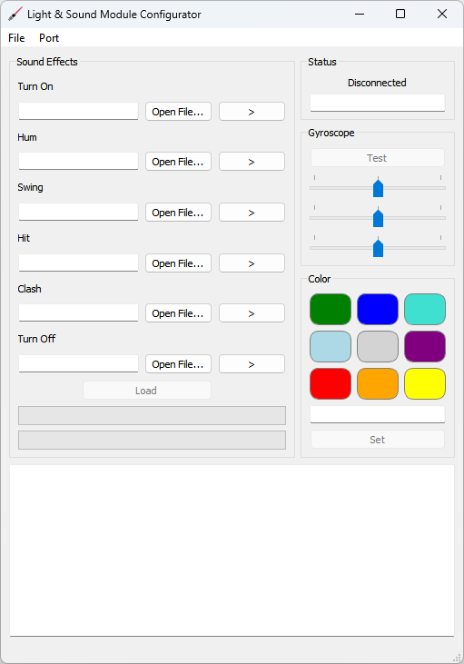

# Light & Sound Module for Lightsaber

This is a completely open hardware and software project.  
The main idea is to create a tiny electronic module that imitates light and sound effects of a Lightsaber.  
Lightsaber is a well-know Jedi weapon from the fantasy universe of [Star Wars](https://en.wikipedia.org/wiki/Star_Wars), created by George Lucas.

## Overview

Module is hidden inside the hilt of a toy Lightsaber. It has a battery power and works autonomously.  
  
Module is waiting in a standby mode for a signal from the button. When the button is pressed the module turns on all the LEDs on the strip one by one and plays a corresponding sound effect. Then in idle mode the module plays repetitively a humming sound and continuously reads accelerometer data. When a movement is detected the module selects hit or swing sound effect according to calculated intensity. In case of the contact with any conductive object the module repetitively plays a clash sound until the contact is lost. Pressing a button again activates the shutdown cycle, module turns off all the LEDs in reverse order and plays a corresponding sound effect.  
The color of the LEDs and all the sound effects are configurable and are kept in the non-volatile memory. Configuration is done by the desktop application which connects to the module via a maintenance interface.

## Repository Contents

* **avr-board/** - Schematics and board design project
* **avr-firmware/** - Firmware sources for the module board
* **doc/** - General project documentation files
* **package/** - Everything you need for manufacturing and assembly of a specific module version (gerbers, binary firmware files, schematics and board design files)
* **service/** - A desktop application sources
* **tracks/** - A collection of selected sound effects for every module operation mode

## Subsystems
Current version (v1.0) is in fact an experimental one. It's purpose was to research and study all the aspects of making such a module. It is based on ATmega168 microcontroller. The firmware barely fits to the microcontroller memory, so there is a obvious reason to think about radical platform change. But for now it is what it is. Honestly speaking, I did it with what was at hand at that moment.

### Accelerometer
Current version have two options for an accelerometer.  
The analogue one is based on ADXL330 and occupies several channels of the internal ADC of the microcontroller. It's fast and simple to use, but a little noisy. Possibly due to poor accuracy of internal ADC.  
The digital one is based on MMA7455L and needs the I2C interface. It's more complex to use and requires more logic in the firmware. But it's accuracy seems better, despite some asynchrony in the data transmission.  
Apparently, only one accelerometer type should be chosen for future design.

### Contact Sensor
This is most controversial idea in the project. Contact sensor is in fact a touch sensor based on AT42QT1011. The solution is working somehow, but obviously needs further development. Touch sensor pin is soldered to the metal base of the LEDs strip. Sometimes it activates from static electricity, and sometimes it doesn't work at all even with direct finger touch. More research work required here.

### Light Control
Multicolored RGB strip is based on series of WS2811 LEDs. It has a custom one-bit protocol and designed to support a serial connection of multiple LEDs. Surprisingly, I did't have any problems with this LEDs and a strip of nearly 20 pieces never had false behavior of any single LED. However, they require a lot of power. The small internal battery died very quickly. So, I had to use larger and rechargeable one. There is a problem with power insufficiency in the schematics, check out problems section below.  
There are some predefined colors according to the movie story. Choose wisely, young apprentice!  

### Sound Playback
Sound effects are played with a speaker and an amplifier TDA7267. The sound itself is generated with PDM logic. Samples are stored in the external flash AT45DB321B. Flash does not have any file system, so samples are stored in raw data format. Address and length of every track (sequence of samples) is stored in the EEPROM memory of the microcontroller.  
The sound quality is rather good. I used some generic 28 mm speaker and even heard some bass notes. Sounds are well guessed and quite similar to the original ones from the movies.

## Board and Schematics
Go to the `avr_board` folder. Here you can find schematics and board design files made with [Eagle CAD 7.6.0](http://eagle.autodesk.com/eagle/software-versions/2) program.  
The schematics required only two-layered board. So it's possible to make an assembly without any special equipment. Only a simple solderer and a lot of patience. I did not used resistors or capacitors smaller than 0805.  
When the first version was tested, I revealed a lot of problems in the schematics, all are listed in the problems section below.  
However, the module works and gave a lot of fun when shown to close friends. They didn't expected a real Jedi to visit them one evening! As they say, every true Jedi must make his own lightsaber.

## Software

### Firmware
To build the firmware you need avr-gcc toolchain installed. I used [WinAVR](https://winavr.sourceforge.net/) when building in Windows.  
Go to the `avr_firmware` folder and simply run `make` in shell. The binary is `avr_firmware/build/lsmod.hex` file.  
To load the firmware you need an ISP programmer and an [avrdude](https://www.nongnu.org/avrdude/) utility. I used [AVR Dragon](https://www.digikey.com/en/products/detail/microchip-technology/ATAVRDRAGON/1124251), but I'm sure any ISP programmer would fit. You may need to change *DUDE_PRG* variable in the Makefile to make it work. Run `make test` to check programmer is fine.  
Then run `make prog` to load the firmware.  
You may also need to set fuses. Run `make fuse` to do it.

### Desktop Application
The application is written in Python and is based on PyQt5 framework. It's working fine with [Python 3.8.10](https://www.python.org/downloads/release/python-3810/) distribution.  
Obviously you need the Qt5 framework. I used [Qt 5.9.2](https://download.qt.io/archive/qt/5.9/5.9.2/).  
Go to the `service` folder and run `make setup` to install some additional Python packages first.  
Then run `make` to create files necessary for Python script.  
If you would like to make a single executable to run without any external libraries run `make distro` and check it out inside `service/dist` folder.  

## Module assembly
The only version available for now is and experimental one (v1.0). Files are in the `package` folder.  
However, if you would like to make your own assembly, you are welcome to use gerber files to make the board.  
To view them you can use [gerbview](https://www.gerbview.com/) utility.  
Bill of materials file is also included.  
Moreover, inside the `package` folder there is a prebuilt firmware. The EEPROM data file is only for reference. You still have to load sound files manually.  
They are in the `tracks` folder as well.

## Problems and Wishes
Since it's completely enthusiastic project, I really don't know when I'm going to continue working on it. However I'll leave it here in case I still find some time.  
And let the force be with you. And couple of spare batteries, you're gonna need them!

### Software
* Adjust brightness due to battery charge level - should slightly extend working time;
* Generate some specific malfunction error sound if the battery is low (don't turn on the lightsaber the usual way);
* Measure supply voltage at cold power up (in case RS-232 or USB is connected) - disable normal startup;
* Make light enhancement effects when hit;
* Voltage meter is very unstable - need some filter.

### Design
* Make bottom cover with a speaker like in an old phone (round contacts, no wires);
* Two batteries? Li-Pol accumulator? Separate power line for the LEDs strip? Eats a lot;
* Handle length up to 300 mm;
* Fastening the profile with LEDs strip on some strong adapter brackets - it breaks after couple of real hits;
* Diffuser? A translucent mirror shell? Diodes should not be visible;
* Touch! Foil? Winding the diffuser with wire? Metallic paint?
* LEDs strip IP65 (filled with silicone)?
* Volume knob;
* Battery holders - 2 x 3 AAA? Combined with a speaker? Plug-in block;
* Motion sensors - on the edge of the board (at the maximum distance from the hand);

### Schematics:
* Separate 7805 or other 1.5 IC for the strip;
* Connector for programmer WB-6;
* Combined connector "power + speaker";
* Combined connector "strip + touch + buttons + regulator";
* 3.3 V Zener diode for ADC;
* Divide the circuit by elements (in BOM too) into two versions of the motion sensor (analogue, digital);
* Connector for RS-232 (USB in the future) - 5V power supply! And bring it to the side under a separate cutout in the case;
* Remove all solderpads - they are useless;
* Analog touch sensitivity adjust;
* Low frequency amplifier with LM386 volume control - and the brightness control at the same time.

## Licenses and Intellectual Property Rights
Unless otherwise noted, code is licensed under the MIT license (check out LICENSE file).  
Schematics and design is licensed under [CERN-OHL-P](https://ohwr.org/cern_ohl_p_v2.txt) license.  
STAR WARS and LIGHTSABER are trademarks of Lucasfilm Entertainment Company Ltd.
